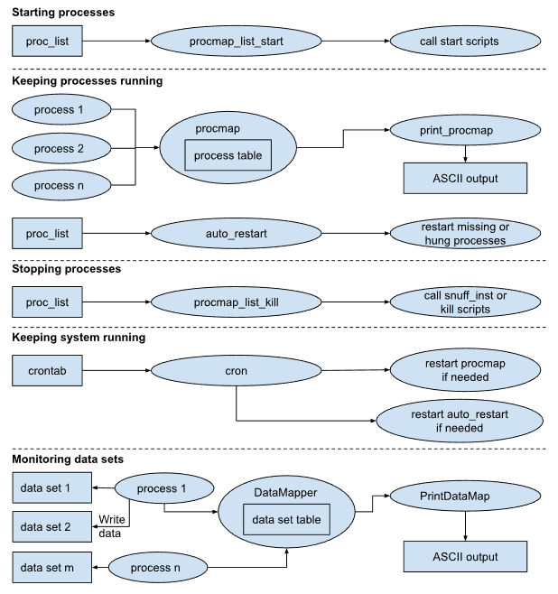

# Data flow and triggering in real-time operations

## Overview

There are a number of components that make up the LROSE realtime data flow and triggering system.

| Component  | Description |
| -----      | ----------- |
| FMQ        | Fast Message Queue. Passes message-based data from one process to the next. |
| Data Files | Applications read a file, process the data, write file(s). File formats include: (a) IWRF time series, (b) CfRadial NetCDF for polar radar data, (c) CF-compliant NetCDF for Cartesian data, (d) XML, (e) various binary formats (e.g. Titan). |
| latest_data_info | Files and FMQ keeping track of latest data as written to the disk. |
| DataMapper | Stores current state of data system. This is a server. Applications register with DataMapper when they write data. |
| PrintDataMap | App to print the DataMapper status. |

## The Fast Message Queue (FMQ)

The Fast Message Queue (FMQ) functionality is provided by the FMQ class in the `libs/Fmq` library in LROSE.

An FMQ comprises 2 circular buffers:

* stat: index of message status details in main buffer containing the messages.
* buf: main buffer containing the messages.

A message is contiguous array of bytes, in any arbitrary format. The applications need to know and understand the contents of the messages.

The status queue comprises a status header (q_stat_t) followed by an array of slots (q_slot_t), one slot for each message in the main buffer. (The FMQ slots precede the QT SLOT mechanism and are unrelated.)

The status header definition is:

```
  typedef struct {
    
    si32 magic_cookie;    /* magic cookie for file type */
    
    si32 youngest_id;     /* message id of last message written */
    si32 youngest_slot;   /* num of slot which contains the
			   * youngest message in the queue */
    si32 oldest_slot;     /* num of slot which contains the
			     oldest message in the queue */
    
    si32 nslots;          /* number of message slots */
    si32 buf_size;        /* size of buffer */
    
    si32 begin_insert;    /* offset to start of insert free region */
    si32 end_insert;      /* offset to end of insert free region */
    si32 begin_append;    /* offset to start of append free region */
    si32 append_mode;     /* TRUE for append mode, FALSE for insert mode */
    
    si32 time_written;    /* time at which the status struct was last
			   * written to file */
    
    /* NOTE - blocking write only supported for 1 reader */
    
    si32 blocking_write;  /* flag to indicate blocking write */
    si32 last_id_read;    /* used for blocking write operation */
    si32 checksum;
    
  } q_stat_t;
```

The slot definition is:

```
  // FMQ slot struct
  
  //   Messages are stored in the buffer as follows:
  //        si32         si32                             si32
  //   --------------------------------------------------------
  //   | magic cookie |  slot_num  | -- message -- | pad |  id  |
  //   --------------------------------------------------------
  //   Pad is for 4-byte alignment.
  
  typedef struct {
    
    si32 active;          /* active flag, 1 or 0 */
    si32 id;              /* message id 0 to FMQ_MAX_ID */
    si32 time;            /* Unix time at which the message is written */
    si32 msg_len;         /* message len in bytes */
    si32 stored_len;      /* message len + extra 12 bytes (FMQ_NBYTES_EXTRA)
			   * for magic-cookie and slot num fields,
			   * plus padding out to even 4 bytes */
    si32 offset;          /* message offset in buffer */
    si32 type;            /* message type - user-defined */
    si32 subtype;         /* message subtype - user-defined */
    si32 compress;        /* compress mode - TRUE or FALSE */
    si32 checksum;
    
  } q_slot_t;

```

---
**NOTE**

Some of these need to be updated to 64-bit integers. 

youngest_slot, oldest_slot and nslots must remain type si32 (int) to ensure atomic read/writes. This is not a limitation, since we would never need more that a billion slots.

---

An FMQ can be either file-based or shared-memory based.

| FMQ type   | Speed | Description |
| -----      | ----- | ----------- |
| file       | slower | 2 files: name.stat (status queue) and name.buf (message queue). The FMQ path includes the fmq name. For example `/tmp/fmq/moments/long_pulse`. The files would be `/tmp/fmq/moments/long_pulse.stat` and `/tmp/fmq/moments/long_pulse.buf`. |
| shmem      | faster | 2 buffers in one shared memory segment. FMQ path included the text 'shmem' followed by the shmem key. For example `/tmp/fmq/ts/short_pulse/shmem_10002`. Shared memory key is 10002. A lock file is created in the directory. In this case it would be `/tmp/fmq/ts/short_pulse/shmem_10002.lock`. |


The figure below shows how these components interact:



## Directory structure

We have a top-level directory, normally called projDir, and referred to by the environment variable $PROJ_DIR.

The directories for the project lie below projDir.

Often the data and log directories are on a separate disk partition, because of disk usage requirements for the data, in which case these directories will be symbolic links.

The following lists a typical directory structure for a lrose system running in real-time:

```
lrose/bin    (binaries and general scripts)
projDir/
  control/ (process list and cron table)
    proc_list
    crontab
  data/    (probably a symbolic link to a data disk)
    raw/   (raw input data)
    mdv/   (MDV data)
    spdb/  (SPDB data)
    fmq/   (FMQ data)
    titan/ (titan storm track data)
  logs/      (may be a symbolic link)
    errors/  (error logs)
    restart/ (restart logs)
    distrib/ (file distribution logs)
  system/
    scripts/  (general system scripts)
    params/   (general system parameters)
  ingest/
    scripts/  (start scripts for ingest processes)
    params/   (parameters for ingest processes)
  algorithm/
    scripts/  (start scripts for algorithm processes)
    params/   (parameters for algorithm processes)
  display/
    scripts/  (start scripts for displays)
    params/   (parameters for displays)
    maps/     (maps for displays)
    color_scales/ (color scales for displays)
```

The control files ```proc_list``` and ```crontab``` are located in dir: ```~projDir/control```.

The application binaries and some system scripts are found in ~/lrose/bin. These are the programs which actually perform the work in the real-time system.

In addition to the scripts in the bin directory, the start scripts for the processes are found in the script directories in the system, ingest, display etc. sub-directories.

## ```procmap``` - the process mapper

The process mapper, ```procmap```, lies at the heart of the auto-restart capabilities of the lrose system. procmap keeps a table of the current status of all processes running on the system, except for itself. Each running process registers with procmap at regular intervals, usually once per minute. This is called the ‘heart-beat’ interval. The process status table is read from procmap by the auto_restart script and compared against the list of expected processes in the proc_list. If a process is missing or has not registered its heartbeat recently, it is killed (in case it is hung) and then restarted.

procmap may be queried by the application ```print_procmap``` which prints out the current table of processes, along with status information.

## ```DataMapper``` - the data mapper

The DataMapper performs a task similar to procmap, except for data sets instead of processes. The DataMapper keeps a table of all data sets on the system, along with such information as the last time data was added to the data set, how many files exist in the data set and how much disk space it occupies.

Each time an application writes data to disk it also registers that activity with the DataMapper. That allows the DataMapper to keep an up-to-date status table. The DataMapper table may be queried by the application ```PrintDataMap```, which then prints the table information.

## ```auto_restart``` - the auto restarter

This is the most important script. It is responsible for contacting procmap at regular intervals, say once per minute, and checking the table of processes which are running against the proc_list. Any processes which are missing or late in registering are killed with the kill script or kill_inst mechanism (in case they are hung) and then restarted with the start script.

## ```procmap_list_start``` - the process list start script

This script is run at system startup to go through the proc_list and start all processes by calling the start scripts listed in ```proc_list```.

You can, in some circumstances, use the ```start_inst``` mechanism, in which case we do not need a start script.

Many start scripts follow a standard template. For example, the script start_Grib2Mdv.gfs starts the application Grib2Mdv with an instance 'gfs':

```
#! /bin/csh
cd $PROJ_DIR/ingest/params
running "Grib2toMdv -params Grib2toMdv.gfs"
if ($status == 1) then
    Grib2toMdv -params Grib2toMdv.gfs |& \
        LogFilter -d $ERRORS_LOG_DIR -p Grib2toMdv -i gfs >& /dev/null &
endif
```

In this script we perform the following standard steps:

* Change directory to $PROJ_DIR/ingest/params.
* Use the script ```running``` to determine if the process is already running.
* If the process is not running, start it using the parameter file.

In this standard case, the parameter file name is formed as application_name.instance.

If the start script follows this standard template, we can use 'start_inst(dir)' instead of invoking the start script. In the example above, 'dir' is 'ingest'.

Some start scripts perform unique operations that are not handled by the standard template. In this case you need to provide a start script, and list than in proc_list.

For example, consider the following script, start_Radx2Grid.3D.spol:

```
#! /bin/csh
# use MDV because it is more efficient not to go through netcdf
setenv MDV_WRITE_FORMAT FORMAT_MDV
setenv MDV_WRITE_USING_EXTENDED_PATHS TRUE
cd $PROJ_DIR/ingest/params
running "Radx2Grid -params Radx2Grid.3D.spol"
if ($status == 1) then
    Radx2Grid -params Radx2Grid.3D.spol -debug |& \
        LogFilter -d $ERRORS_LOG_DIR -p Radx2Grid -i 3D.spol >& /dev/null &
endif
```
In this example we set 2 environment variables before starting the application. So we cannot use the standard template, and we need to specify the start script.

## ```procmap_list_kill``` - the process list kill script

This script is run at system shutdown to go through the proc_list and kill all processes by calling the kill script or the ```snuff_inst``` mechanism.

If 'snuff_inst' is specified, then procmap_list_kill will run the following command:

```
snuff appname.instance
```

or, more specifically in the case of the prevoius start script:

```
snuff Radx2Grid.3D.spol
```

## ```proc_list``` - the process list

The process list controls which processes (i.e. instances of applications) should be run in the system. It specifies the process name, the instance and the start and kill scripts for the process. The hostname is included for backward compatibility and should always be set to localhost.

The following is an example of a proc_list file, for a Titan-type project, taken from the lrose project templates template_single_radar:

```
########################################################################
# Example proc_list file
#
# name       instance   start_script          kill_script       hostname
########################################################################
# SYSTEM processes
#
DsServerMgr   primary    start_DsServerMgr    snuff_inst        localhost
Janitor       primary    start_Janitor        kill_Janitor      localhost
Scout         primary    start_Scout          kill_Scout        localhost
DataMapper    primary    start_DataMapper     kill_DataMapper   localhost
#########################################################################
# INGEST processes
#
Bprp2Dsr       ops       start_Bprp2Dsr.ops    snuff_inst      localhost
EsdAcIngest    ops       start_inst(ingest)    snuff_inst      localhost
Dsr2Vol        ops       start_inst(ingest)    snuff_inst      localhost
ClutterRemove  cart      start_inst(ingest)    snuff_inst      localhost
########################################################################
# lrose ROCESSES
#
titan          ops       start_inst(titan)      snuff_inst     localhost
PrecipAccum    single    start_inst(titan)      snuff_inst     localhost
PrecipAccum    1hr       start_inst(titan)      snuff_inst     localhost
PrecipAccum    24hr      start_inst(titan)      snuff_inst     localhost
Mdv2Vil        ops       start_inst(titan)      snuff_inst     localhost
Tstorms2Spdb   ops       start_inst(titan)      snuff_inst     localhost
########################################################################
# DISPLAY processes
#
Rview          ops       start_Rview.ops      snuff_inst       localhost
TimeHist       ops       start_Rview.ops      snuff_inst       localhost
RadMon         ops       start_RadMon.ops     kill_RadMon.ops  localhost
CIDD           ops       start_CIDD.ops       snuff_inst       localhost
###############################################################################
```

The following is an example of a proc_list file for the APAR simulator:

```
###############################################################################
# SYSTEM processes
#
DsServerMgr   primary    start_DsServerMgr         snuff_inst        
DsFmqServer   manager    start_DsFmqServer         snuff_inst        
Janitor       logs       start_Janitor.logs        kill_Janitor      
Scout         primary    start_Scout               kill_Scout        
DataMapper    primary    start_DataMapper          kill_DataMapper   
#
###############################################################################
# controller
#
AparController ops        start_AparController     stop_AparController
###############################################################################
# apar_rsp
#
apar_rsp      ops        start_apar_rsp.ops        stop_apar_rsp
###############################################################################
# Moments
#
AparTs2Moments  long_pulse      start_inst(moments)     snuff_inst
AparTs2Moments  short_pulse     start_inst(moments)     snuff_inst
Dsr2Radx        moments.long_pulse      start_inst(moments)     snuff_inst
Dsr2Radx        moments.short_pulse     start_inst(moments)     snuff_inst
#
###############################################################################
# Saving time series data
#
AparTsArchive long_pulse     start_inst(archive)     snuff_inst
AparTsArchive short_pulse    start_inst(archive)     snuff_inst
#
###############################################################################
# Saving status data
#
AparStatusArchive long_pulse      start_inst(archive)     snuff_inst
AparStatusArchive short_pulse    start_inst(archive)     snuff_inst
#
###############################################################################
# Displays
#
RadMon      long_pulse    start_RadMon.long_pulse   snuff_inst
RadMon      short_pulse   start_RadMon.short_pulse  snuff_inst
###############################################################################
```

The application binary must be in the search path. The instance for a process is used to distinguish between different instances of the same process. In the example above, PrecipAccum is running with 3 different instances, one to convert single radar scans into precipitation amounts and the other two to accumulate precipitation into 1 and 24 hour running totals.

If a specific start script for a process exists, it should be specified. If not, the ```start_inst``` mechanism may be used. See details in 'procmap_list_kill' above.

If special action must be taken to kill the application, a kill script should also be supplied. However, if nothing special is needed to kill the application the entry ```snuff_inst``` can be used instead. Based on that entry the system will kill the application based on its name and instance.

This script is called at system shutdown to go through the proc_list and kill all processes by calling the kill script or the ```snuff_inst``` mechanism.

## cron table file

The cron daemon on a UNIX system is designed to run tasks on a predefined schedule. The so-called cron table is used to specify which tasks are to be scheduled.

Below is a typical crontab file for a lrose real-time system:

```
##########################################################################
#
# Example cron table for lrose
#
# Process restarters
*/1 * * * *  csh -c “start_auto_restart_check_cron” 1> /dev/null 2> /dev/null
*/1 * * * *  csh -c “start_procmap_check_cron”      1> /dev/null 2> /dev/null
#
# Build links to log date subdirs
*/5 * * * *   csh -c “start_build_logdir_links” 1> /dev/null 2> /dev/null
#
```

There are 3 scheduled tasks:
* every 1 minute the script start_auto_restart_check_cron is run to ensure that the auto_restart script is running.
* every 1 minute the script start_procmap_check_cron is run to ensure that procmap is running.
* every 5 minutes start_build_logdir_links runs to create symbolic links in the log directories to point to log files for yesterday and today. The log files are stored in directories named for the date, i.e. yyyymmdd. The links are a convenient way to easily find the log files for today and yesterday.

## Starting the real-time system

To start the system on a host, we set up a script called ```start_all```.

Generally, this script performs the following steps:

* Starts the process mapper procmap.
* Starts all of the processes listed in the process list file: ~/projDir/control/proc_list 
* Starts the auto_restart script. 
* Installs the cron table: ~/projDir/control/crontab

Here is a standard start_all script:

```
#! /bin/csh 

#
# Start up entire system...
#

#
# start the procmap first so we can watch everything come up
#

start_procmap

#
# do a fast-start from the process list. We sleep between starts
# to prevent overloading the system
#
 
procmap_list_start -sleep 0 \
  -proc_list $PROJ_DIR/control/proc_list

#
# starting up the auto_restart should start up anything
# that didn't come up during the fast-start
#
start_auto_restart

#
# install the crontab which insures that procmap and
# the auto_restarter are always going
#
install_crontab
```

To check that the system started correctly, run the command: 

```
pcheck
```

```pcheck``` checks that all of the required processes have been successfully started. If there are no problems you should get the message: 

```
0 processes down
```

If any processes are down, check that the start scripts and that you can successfully start them by hand. Frequently problems with this step are related to typos which are difficult to spot.

## Stopping the real-time system

To stop the system on a host, we generally set up an overall stop script:

```
stop_all
```

This script performs the following steps, in order: 

* Removes the crontab. 
* Stops the auto_restart script. 
* Stops procmap.
* Stops all of the other lrose processes. 
* Removes any shared memory segments.

The following is a standard stop_script:

```
#! /bin/csh

#
# Shut down entire system
#

# remove crontab and kill the auto-restarter

remove_crontab
kill_auto_restart

# kill all processes, including procmap

killall_processes

# remove shared memory segments

ipcrm_linux
```

## Starting and stopping individual processes

There are two scripts, snuff and snuff_inst, which are useful for stopping individual processes.

To kill all processes with a specified name, run the command:

```
snuff process_name
```

To kill all processes with a specified name and instance, run the command:

```
snuff_inst process_name instance
```

To start a process, just call the relevant start script. For processes which appear in the proc_list, the auto_restart script will restart the process anyway.

## Quick check on the real-time system

To check that all processes are running, type the command: 

```
pcheck
```

This is an alias for:

```
procmap_list_check -proc_list ~/projDir/control/proc_list
```

This will report any processes which are down. For example, if the DataMapper is down you would see:

```
1 process(es) down
DataMapper primary missing
```

If all processes are running you will get the message:

```
0 processes down
```

If any processes are down, check that the start scripts exist and that you can successfully start them by hand using those scripts. Frequently problems with this step are related to typos which are difficult to spot.

## Detailed check: print out all processes

To print a table of all processes running on a host, type the following command:

```
ppm
```

ppm is an alias for:

```
print_procmap -hb -up -status
```

You can check the processes on a remote host:

```
ppm -host hostname
```

To see the print repeated every 5 seconds, type:

```
ppm -c 5
```

ppm will produce a listing as follows (this is for the APAR simulator):

```
% ppm
PROCS REGISTERED - localhost - Mon Apr  1 16:40:49 2024
Uptime: 0:20:51

Name               Instance             Host          User  Pid    Htbeat   Uptime   Status
====               ========             ====          ====  ===    ======   ======   ======
AparStatusArchive  long_pulse           apar-trenton  apar  414303 0:00:26  0:20:46  Getting next pulse
AparTs2Moments     long_pulse           apar-trenton  apar  414296 0:00:28  0:20:48  In FMQ::_read_blocking()
AparTs2Moments     short_pulse          apar-trenton  apar  414298 0:00:27  0:20:47  In FMQ::_read_blocking()
Condor             long_pulse           apar-trenton  apar  414864 0:00:48  0:01:49  timerEvent
DataMapper         primary              apar-trenton  apar  414292 0:00:29  0:20:49  Listening, port: 5434
DsFmqServer        manager              apar-trenton  apar  414287 0:00:31  0:20:51  Listening, port: 5443
DsServerMgr        primary              apar-trenton  apar  414285 0:00:31  0:20:51  Listening, port: 5435
Dsr2Radx           moments.long_pulse   apar-trenton  apar  414300 0:00:08  0:20:47  Processing volume
Dsr2Radx           moments.short_pulse  apar-trenton  apar  414301 0:00:08  0:20:46  Processing volume
Janitor            logs                 apar-trenton  apar  414289 0:00:30  0:20:50  Sleeping between passes
Scout              primary              apar-trenton  apar  414290 0:00:30  0:20:50  Sleeping between runs
apar_rsp           ops                  apar-trenton  apar  414892 0:01:23  0:01:23  PMU_auto_init
```

The columns in the above list have the following meanings:

| Label | Description |
| -----     | ----------- |
| Name  | Process (application) name |
| Instance | Process instance. There may be more than one instance of an application running. The instance is required for a unique reference to each instance. |
| Host  | Normally 'localhost' |
| User  | Who started the process |
| Pid   | Process ID |
| HtBeat | The time since the latest heartbeat, in seconds. Each program registers with the process mapper (procmap) at regular intervals, normally every minute. The heartbeat time gives the time since the last heartbeat. If you run 'ppm -maxint', you will see the maximum heartbeat interval, which is generally twice the normal heartbeat interval. So for most processes this will be 120 secs. If the process fails to heartbeat within this interval, it will be killed and restarted by the auto_restart script. |
| Uptime | How long the process has been up |
| Status | Status information, as reported by the app at the latest registration. |

## Checking the data sets

To print a table of all data sets available on a host, type the following command: 

```
pdm
```

Or, for data sets on a different host: 

```
pdm -host hostname
```

To see the print repeated every 5 seconds, type:

```
pdm -c 5
```

pdm is an alias for:

```
PrintDataMap -all -relt -lreg
```

pdm will produce a listing as follows (this is for the APAR simulator):

```
% pdm
=========== Data on host 'localhost' at time 2024/04/01 16:40:46 ==========
DataType  Dir                                       HostName         Latest   Last reg  Start date    End date  nFiles  nBytes
========  ===                                       ========         ======   ========  ==========    ========  ======  ======
fmq       /tmp/fmq/moments/long_pulse/shmem_20000   apar-trenton  -00:03:11  -00:03:11                                        
fmq       /tmp/fmq/moments/short_pulse/shmem_20002  apar-trenton  -00:03:11  -00:03:11                                        
fmq       /tmp/fmq/ts/long_pulse/shmem_10000        apar-trenton  -00:03:07  -00:03:07                                        
fmq       /tmp/fmq/ts/short_pulse/shmem_10002       apar-trenton  -00:03:07  -00:03:07                                        
nc        cfradial/moments/long_pulse               apar-trenton  -00:03:07  -00:02:51  2001/01/01  1985/10/19     52K     37G
nc        cfradial/moments/short_pulse              apar-trenton  -00:03:07  -00:02:51  2001/01/01  1985/11/22     54K     33G
spdb      spdb/monitoring/long_pulse                apar-trenton  -00:03:10  -00:03:10  2023/12/16  2024/04/01      36    2.5M
txt       catalog/monitoring/long_pulse             apar-trenton  -00:03:21  -00:03:20                                        
                                                                                                                ======  ======
                                                                                                                  106K     70G
```

The columns in the above list have the following meanings:

| Label | Description |
| -----     | ----------- |
| DataType  | category of data, for example: (a) raw: data in native input format, (b) mdv: gridded format, (c) spdb: symbolic product format (non-gridded), (d) titan: titan storm and track files |
| Dir | The directory for the data. This is relative to $DATA_DIR, which is normally ~/projDir/data. |
| HostName  | The hostname on which the data is stored. Normally 'localhost'. |
| Latest | The time of the latest data on the disk. This is relative to 'now'. |
| Last reg | The time at which the data set was last registered with DataMapper. This is relative to 'now'. The process which writes the data to disk is responsible for registering with DataMapper. The last registration time gives you an idea about whether the data is coming in on time. |
| Start date | The start date of the data set. This is reported by the Scout. |
| End date | The end date of the data set. This is reported by the Scout. |
| nFiles | The number of files in the data set. This is reported by the Scout. |
| nBytes | The number of bytes in the data set. This is reported by the Scout. |

## Changing the process list on the fly

You can change the process list without having to restart the entire system.

If you add a process/instance to the proc_list, the auto_restart script will try to start that process then next time it checks the list.

If you remove a process/instance from the proc_list, you will need to call snuff_inst to kill that process.

## Changing the cron table on the fly

You can change the cron table without having to restart the entire system.

If you make a change to the crontab file, you can activate that table by running the command:

```
install_cron
```

The following is an example of install_cron:

```
% cat install_crontab 
#! /bin/csh
crontab $PROJ_DIR/control/crontab >>&!  $ERRORS_LOG_DIR/crontab
```

To see the active cron table, run the command:

```
crontab -l
```

To remove the current cron table, run the command:

```
crontab -r
```

## Log files.

There are 3 possible sets of log files:

| Purpose | Description | Normal location |
| -----   | ----------- | --------------- |
| errors  | Error and warning messages from processes. | ```~/projDir/logs/errors``` |
| restart | Restart messages from auto_restart. | ```~/projDir/logs/restart``` |
| distrib | Messages from file distribution, using DsFileDist app. | ```~/projDir/logs/distrib``` |

The logs files themselves reside in subdirectories named using the date. As an example, the error logs for 2023/09/25 will be written to ~/projDir/logs/errors/20230925.

The error logs contain all error messages generated by the processes themselves. The log files are named after the process name and instance. For example, the PrecipAccum application running as instance 24hr will create a log file called PrecipAccum.24hr.log.

The restart logs are written by the auto_restart script and show all restart activity.

We generally set up a number of environment variables to control the locations of the log files. The following is an example, using c-shell syntax:

```
setenv LOG_DIR $DATA_DIR/logs
setenv ERRORS_LOG_DIR $LOG_DIR/errors
setenv RESTART_LOG_DIR $LOG_DIR/restart
setenv DATA_DISTRIB_LOG_DIR $LOG_DIR/distrib
```

For convenience links are provided in $LOG_DIR to the logs from yesterday and today. The link is updated every 5 minutes (see cron) using the script ```start_build_logdir_links```.

As an example, the links for the errors could be the following:

```
today -> /home/rsfdata/data/logs/errors/20240331
yesterday -> /home/rsfdata/data/logs/errors/20240330
```

## LogFilter

The log files are managed by piping the stderr and stdout output from processes through a specially-written filter called LogFilter. This application reads data from standard input and writes it to a daily file.

```LogFilter``` is a C++ application that is designed to read in the output streams (stdout and stderr) from upstream processes, duplicate this stream, and write it to log files in a designated location. See the 'Log files' section above.


The following is an example of a c-shell start script that invokes the LogFilter:

```
#! /bin/csh
# use MDV because it is more efficient not to go through netcdf
setenv MDV_WRITE_FORMAT FORMAT_MDV
setenv MDV_WRITE_USING_EXTENDED_PATHS TRUE
cd $PROJ_DIR/ingest/params
running "MdvMerge2 -params MdvMerge2.3D_mosaic"
if ($status == 1) then
    MdvMerge2 -params MdvMerge2.3D_mosaic -debug |& \
	LogFilter -d $ERRORS_LOG_DIR -p MdvMerge2 -i 3D_mosaic >& /dev/null &
endif
```

## The Janitor

The Janitor application is used by the real-time system to keep the disk from filling up. A full disk is fatal for any system running in real-time with new data arriving, since when the disk is full no new data will be written and the system will fail.

The Janitor has three major functions:

* to delete files which are older than specified age.
* to delete empty directories
* to compress files which are older than a specified age.

WARNING: the Janitor is a potentially DESTRUCTIVE program which will faithfully delete whatever you tell it to delete. So be careful to set it up correctly. In the parameter file you can set report mode on so that the Janitor will leave small text files at the nodes visited to aid in debugging.

Mostly the Janitor is set up to keep the log file area from filling up and causing the system to fail.

The Janitor operates by traversing the data directory tree, starting at an entry point referred to as the ‘top-dir’. Normally it starts at $DATA_DIR. By default the Janitor does nothing other than traverse the directory tree looking for parameter files named _Janitor.

When it finds an _Janitor parameter file, it reads in that file and uses it to override the current settings. The overridden settings only apply from that point DOWN in the tree, and until another _Janitor file is found. As the Janitor pops back up the tree it reverts to using the parameters which were in effect at the upper level, before descending to lower levels.

To set up the Janitor, normally a _Janitor file is placed in $DATA_DIR, to specify the starting behavior as it traverses the tree. At the top level it is normally set up to do nothing. Then, _Janitor files are placed at positions in the data tree designed to control the behavior from that point down. If you need all files below a given point to be deleted after 5 days, set the parameters at that level to indicate that preference. Similarly for compression.

There are a number of file types which the _Janitor will not delete. These include files beginning with underscore ‘_’. That is the reason that the name of any parameter file in the data area always starts with an underscore.

The Janitor can be set up to save data in so-called ‘event lists’. If you want to age off all data except that for certain events, put this information in the event list at the top level.

The early version of the Janitor only specified file ages in seconds. This became cumbersome, but was retained for backward compatibility reasons. Some parameters were added to allow you to specify the ages in days, instead of seconds. These are as follows:

```
///////////// file_ages_in_days ///////////////////////
//
// Option to specify file ages in days, instead of secs.
// If TRUE, ‘MaxNoModDays’ and ‘MaxNoAccessDays’ are used. If FALSE, 
//   ‘MaxModificationAgeBeforeDelete’ and
// ‘MaxAccessAgeBeforeCompress’ are used.
// Type: boolean
//

file_ages_in_days = FALSE;

///////////// MaxNoModDays ////////////////////////////
//
// Max file age before deletion - days. Used if ‘file_ages_in_days’
//   is TRUE.
// If delete_files is TRUE, a file will be deleted if it has not been 
//   modified in this amount of time.
// Type: float
//

MaxNoModDays = 30;

///////////// MaxNoAccessDays /////////////////////////
//
// Max quiescent age before compression - days. Used if 
//   ‘file_ages_in_days’ is TRUE.
// If compress is TRUE, a file will be compressed if it has not been 
//   accessed within this time.
// Type: float
//

MaxNoAccessDays = 1;
```

There is another parameter which can cause confusion, named date_format. By default it is TRUE.

```
///////////// date_format /////////////////////////////
//
// Option to check for RAP date-time naming convention.
// If set, the files must follow the RAP file naming
// convention (which means that the filename is based
// on the date that the data in the file pertains to).
// Type: boolean
//

date_format = TRUE;
```

If date_format is left TRUE, The Janitor will only delete files which conform to certain naming conventions related to the date and time. This works fine for most files within the lrose system. However, it often will not work with raw files provided from other sources. Therefore, to be sure to delete all file types, set this to FALSE.

You can tell the Janitor to avoid certain parts of the tree altogether. This saves CPU and ensures you will not delete anything in that area.

```
///////////// recurse /////////////////////////////////
//
// Recurse to lower directories.
// Set to false to leave directories below the current directory alone.
// Type: boolean
//

recurse = FALSE;
```

You can also tell the Janitor to avoid processing a single directory while progressing to lower directories:

```
///////////// process /////////////////////////////////
//
// Process files in this directory.
// Set to false to leave the current directory alone.
// However, subdirs are processed unless the recurse
// parameter is set to false.
// Type: boolean
//

process = FALSE;
```

This can get pretty confusing, however, so normally recurse and process are both set to FALSE together to protect a directory.

## The Scout

The Scout is an application with properties similar to the Janitor, except that instead of deleting or compressing files it scans the directories for information about the data sets and registers that information with the DataMapper.

The status information gathered on a data set by the Scout is:

* start date 
* end date
* number of files
* number of bytes

The Scout is useful because it helps summarize the status of the data sets. However, it is not essential to the operation of the real-time system.

