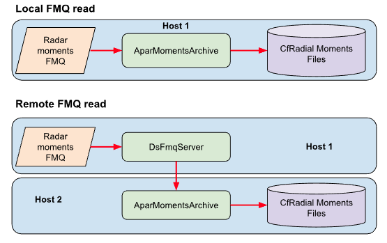
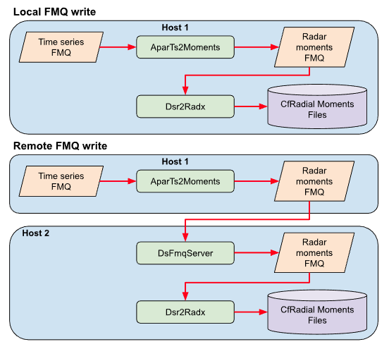
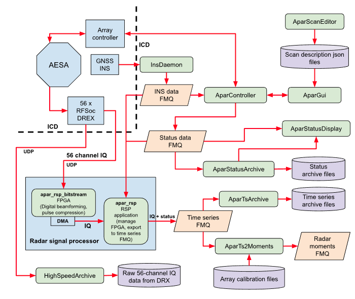

# Data flow and triggering in real-time operations

## Overview

There are a number of components that make up the LROSE realtime data flow and triggering system.

| Component  | Description |
| -----      | ----------- |
| FMQ        | Fast Message Queue. Passes message-based data from one process to the next. |
| Data Files | Applications read a file, process the data, write file(s). File formats include: (a) IWRF time series, (b) CfRadial NetCDF for polar radar data, (c) CF-compliant NetCDF for Cartesian data, (d) XML, (e) various binary formats (e.g. Titan). |
| latest_data_info | Files and FMQ keeping track of latest data as written to the disk. |
| DataMapper | Stores current state of data system. This is a server. Applications register with DataMapper when they write data. |
| PrintDataMap | App to print the DataMapper status. |

## The Fast Message Queue (FMQ)

The Fast Message Queue (FMQ) is fundamental to the real-time operations in LROSE. It allows messages to be written to a queue by a single writer, and read by multiple readers. This allows data streams to be fed to multiple applications. Reads are implemented via efficient polling, which makes FMQs lightweight in terms of CPU usage.

FMQ is implemented by the Fmq (and DsFmq) classes in the `libs/Fmq` library.

An FMQ comprises 2 circular buffers:

* stat: index of message status details in main buffer containing the messages.
* buf: main buffer containing the messages.

There is also a **.lock** file, which guarantees a single writer.

A message is contiguous array of bytes, in any arbitrary format. The applications need to know and understand the contents of the messages.

The status queue comprises a status header (q_stat_t) followed by an array of slots (q_slot_t), one slot for each message in the main buffer. (The FMQ slots precede the QT SLOT mechanism and are unrelated.)

The status header definition is:

```
  typedef struct {
    
    si32 magic_cookie;    /* magic cookie for file type */
    
    si32 youngest_id;     /* message id of last message written */
    si32 youngest_slot;   /* num of slot which contains the
			   * youngest message in the queue */
    si32 oldest_slot;     /* num of slot which contains the
			     oldest message in the queue */
    
    si32 nslots;          /* number of message slots */
    si32 buf_size;        /* size of buffer */
    
    si32 begin_insert;    /* offset to start of insert free region */
    si32 end_insert;      /* offset to end of insert free region */
    si32 begin_append;    /* offset to start of append free region */
    si32 append_mode;     /* TRUE for append mode, FALSE for insert mode */
    
    si32 time_written;    /* time at which the status struct was last
			   * written to file */
    
    /* NOTE - blocking write only supported for 1 reader */
    
    si32 blocking_write;  /* flag to indicate blocking write */
    si32 last_id_read;    /* used for blocking write operation */
    si32 checksum;
    
  } q_stat_t;
```

The slot definition is:

```
  // FMQ slot struct
  
  //   Messages are stored in the buffer as follows:
  //        si32         si32                             si32
  //   --------------------------------------------------------
  //   | magic cookie |  slot_num  | -- message -- | pad |  id  |
  //   --------------------------------------------------------
  //   Pad is for 4-byte alignment.
  
  typedef struct {
    
    si32 active;          /* active flag, 1 or 0 */
    si32 id;              /* message id 0 to FMQ_MAX_ID */
    si32 time;            /* Unix time at which the message is written */
    si32 msg_len;         /* message len in bytes */
    si32 stored_len;      /* message len + extra 12 bytes (FMQ_NBYTES_EXTRA)
			   * for magic-cookie and slot num fields,
			   * plus padding out to even 4 bytes */
    si32 offset;          /* message offset in buffer */
    si32 type;            /* message type - user-defined */
    si32 subtype;         /* message subtype - user-defined */
    si32 compress;        /* compress mode - TRUE or FALSE */
    si32 checksum;
    
  } q_slot_t;

```

---
**NOTE**

Some of the struct members (time_written, buf_size, begin_insert, end_insert, begin_append, time, msg_len, stored_len, offset) need to be updated to 64-bit integers.

youngest_slot, oldest_slot and nslots must remain type si32 (int) to ensure atomic read/writes. This is not a limitation, since we would never need more that a billion slots.

---

An FMQ can be either file-based or shared-memory based.

| FMQ type   | Speed | Description |
| -----      | ----- | ----------- |
| file       | slower | 2 files: name.stat (status queue) and name.buf (message queue). The FMQ path includes the fmq name. For example `/tmp/fmq/moments/long_pulse`. The files would be `/tmp/fmq/moments/long_pulse.stat` and `/tmp/fmq/moments/long_pulse.buf`. |
| shmem      | faster | 2 buffers in one shared memory segment. FMQ path included the text 'shmem' followed by the shmem key. For example `/tmp/fmq/ts/short_pulse/shmem_10002`. Shared memory key is 10002. A lock file is created in the directory. In this case it would be `/tmp/fmq/ts/short_pulse/shmem_10002.lock`. |

## Configuring an FMQ

When creating an FMQ, it must be configured to handle the characteristics of the data. You need to ask:

* how large are the messages?
* how fast are the messages arriving?
* how fast will the readers be able to comsume the messages?

The following parameters must be set when creating an FMQ:

| Parameter  | Typical value | Description |
| -----      | ------------- | ----------- |
| numSlots   | 1000 | The number of slots in the status queue. The FMQ will wrap when the number of slots is exceeded. |
| bufSize    | 10M  | The size of the message buffer. The FMQ will wrap when the buffer has been filled, and the messages start again at the start of the buffer. |
| compress   | false | Option to compress the messages before storing in the buffer. |
| blocking   | false | Option to block write to avoid wrapping. Should be used in archive mode only, not real-time. Only works with a single reader. In real-time operations, if the reader falls behind, it is essential to wrap and lose data because it is not possible to catch up. In archive operations, we can afford to wait for the reader. |

In **real-time** mode, you need to ensure that both **numSlots** and **bufSize** are large enough to prevent wrapping in your applications. With modern systems it is practical to set numSlots to 10,000 or more, and bufSize to 100M, 1G or more. In real-time mode, it does not really matter whether the status queue or message buffer wraps first.

In **archive** mode with blocking set to true, the blocking is implemented on the status buffer. It is important to ensure that the status buffer wraps first, by setting the number of slots to a low number, say 10 to 100. The message buffer should be set large enough to easily accommodate the number of messages (numSlots).

## Remote message transfer between hosts

When writing applications that use an FMQ, we generally use the **DsFmq** class. This inherits **Fmq**, but adds in the capability to either (a) read FMQ messages from a different host or (b) write messages to a different host.

The **DsFmqServer** application is a server that helps to implement remote read and write operations via an FMQ.

The figure below shows the implementation of a local and remote read:



The figure below shows the implementation of a local and remote write:



## Example of FMQs in action - APAR realtime operations

The following figure is a good example of FMQs in use in a real-time system:



## File-based operations - using the `latest_data_info` mechanism to trigger downstream processes

FMQs are efficient for the passing of data as messages between processes.

For many operations, however, it makes sense for an upstream process to write a file and a downstream process to read that file. In these cases we need an efficient mechanism for triggering the downstream process.

For this we use the **latest_data_info** concept. This began life as simple ASCII files named _latest_data_info, but has since grown to include XML files, and XML messages passed via FMQs specfically for this purpose.

The **latest_data_info** files and FMQ are written to the same directory in which the files are written. In such a directory you will find the following files:

| File  | Description |
| ----  | ----------- |
| _latest_data_info | Original simple ASCII file. No longer used. |
| _latest_data_info.xml | XML version, shows the latest data info for the last file written. |
| _latest_data_info.stat | Status file for **latest_data_info** **FMQ**. |
| _latest_data_info.buf | Message buffer file for **latest_data_info** **FMQ**. |
| _latest_data_info.lock | Lock file for **latest_data_info** **FMQ**. |

---
**NOTE**

The FMQ functionality for _latest_data_info is implemented via the following classes:

| Class | Library | Note |
| ----  | ------- | ----------- |
| LdataInfo | didss | File-based FMQ only. |
| DsLdataInfo | dsserver | Inherits from LdataInfo. Registers with DataMapper on write. |

---


