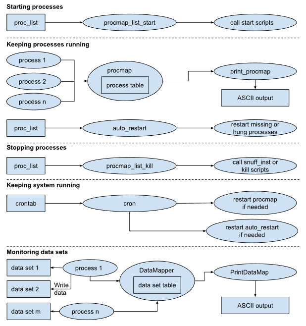

# Real-time operations

## Overview

There are a number of components that make up the LROSE realtime system.

| Component | Description |
| -----     | ----------- |
| procmap   | Process mapper. This is a server. Individual applications register routinely with procmap to confirm that they are alive and running as expected. |
| apps      | Applications register with procmap |
| proc_list | List of required applications |
| procmap_list_start | Start script - reads proc_list, starts apps. (perl) |
| auto_restart | Auto restarter - reads proc_list, checks with procmap if all are running correctly. If a process is not registering correctly, it will kill it (in case it is hung) and restart it. (perl) |
| procmap_list_kill | Kill script - reads proc_list, kills apps. (perl) |
| cron | Keeps auto_restart running. Performs other tasks on a schedule as required |
| DataMapper | Data mapper. This is a server. Applications register with DataMapper when they write data. |
| start_all | Overall start script. (shell, generally c-shell) |
| stop_all | Overall stop script. (shell, generally c-shell) |
| print_procmap | App to print the procmap status. |
| PrintDataMap | App to print the DataMapper status. |

[The figure below shows how these components interact:](./lrose_runtime.png)



## ```procmap``` - the process mapper

The process mapper, ```procmap```, lies at the heart of the auto-restart capabilities of the lrose system. procmap keeps a table of the current status of all processes running on the system, except for itself. Each running process registers with procmap at regular intervals, usually once per minute. This is called the ‘heart-beat’ interval. The process status table is read from procmap by the auto_restart script and compared against the list of expected processes in the proc_list. If a process is missing or has not registered its heartbeat recently, it is killed (in case it is hung) and then restarted.

procmap may be queried by the application ```print_procmap``` which prints out the current table of processes, along with status information.

## ```DataMapper``` - the data mapper

The DataMapper performs a task similar to procmap, except for data sets instead of processes. The DataMapper keeps a table of all data sets on the system, along with such information as the last time data was added to the data set, how many files exist in the data set and how much disk space it occupies.

Each time an application writes data to disk it also registers that activity with the DataMapper. That allows the DataMapper to keep an up-to-date status table. The DataMapper table may be queried by the application ```PrintDataMap```, which then prints the table information.

## ```auto_restart``` - the auto restarter

This is the most important script. It is responsible for contacting procmap at regular intervals, say once per minute, and checking the table of processes which are running against the proc_list. Any processes which are missing or late in registering are killed with the kill script or kill_inst mechanism (in case they are hung) and then restarted with the start script.

## ```procmap_list_start``` - the process list start script

This script is used at system startup to go through the proc_list and start all processes by calling the start scripts, or by using the ```start_inst``` mechanism.

## ```procmap_list_kill``` - the process list kill script

This script is called at system shutdown to go through the proc_list and kill all processes by calling the kill script or the ```kill_inst``` mechanism.

## ```proc_list``` - the process list

The process list controls which applications (also called processes) should be run in the system. It specifies the process name, the instance and the start and kill scripts for the process. The hostname is included for backward compatibility and should always be set to localhost.

The following is an example of a proc_list file, taken from the lrose project templates template_single_radar:

```
########################################################################
# Example proc_list file
#
# name       instance   start_script          kill_script       hostname
########################################################################
# SYSTEM processes
#
DsServerMgr   primary    start_DsServerMgr    snuff_inst        localhost
Janitor       primary    start_Janitor        kill_Janitor      localhost
Scout         primary    start_Scout          kill_Scout        localhost
DataMapper    primary    start_DataMapper     kill_DataMapper   localhost
#########################################################################
# INGEST processes
#
Bprp2Dsr       ops       start_Bprp2Dsr.ops        snuff_inst  localhost
EsdAcIngest    ops       start_inst(ingest)        snuff_inst  localhost
Dsr2Vol        ops       start_Dsr2Vol.ops         snuff_inst  localhost
ClutterRemove  cart      start_inst(ingest)        snuff_inst  localhost
########################################################################
# lrose ROCESSES
#
lrose          ops       start_lrose.ops           snuff_inst  localhost
PrecipAccum    single    start_PrecipAccum.single  snuff_inst  localhost
PrecipAccum    1hr       start_PrecipAccum.1hr     snuff_inst  localhost
PrecipAccum    24hr      start_PrecipAccum.24hr    snuff_inst  localhost
Mdv2Vil        ops       start_Mdv2Vil.ops         snuff_inst  localhost
Tstorms2Spdb   ops       start_Tstorms2Spdb.ops    snuff_inst  localhost
########################################################################
# DISPLAY processes
#
Rview          ops       start_Rview.ops      snuff_inst       localhost
TimeHist       ops       start_Rview.ops      snuff_inst       localhost
RadMon         ops       start_RadMon.ops     kill_RadMon.ops  localhost
CIDD           ops       start_CIDD.ops       snuff_inst       localhost
```

The process binary must be in the search path. The instance for a process is used to distinguish between different instances of the same process. In the example above, PrecipAccum is running with 3 different instances, one to convert single radar scans into precipitation amounts and the other two to accumulate precipitation into 1 and 24 hour running totals.

If a specific start script for a process exists, it should be specified. If not, the ```start_inst``` mechanism may be used. More details on this later on.

If special action must be taken to kill the application, a kill script should also be supplied. However, if nothing special is needed to kill the application the entry ‘snuff_inst’ can be used instead. Based on that entry the system will kill the application based on its name and instance.

This script is called at system shutdown to go through the proc_list and kill all processes by calling the kill script or the ```kill_inst``` mechanism.

